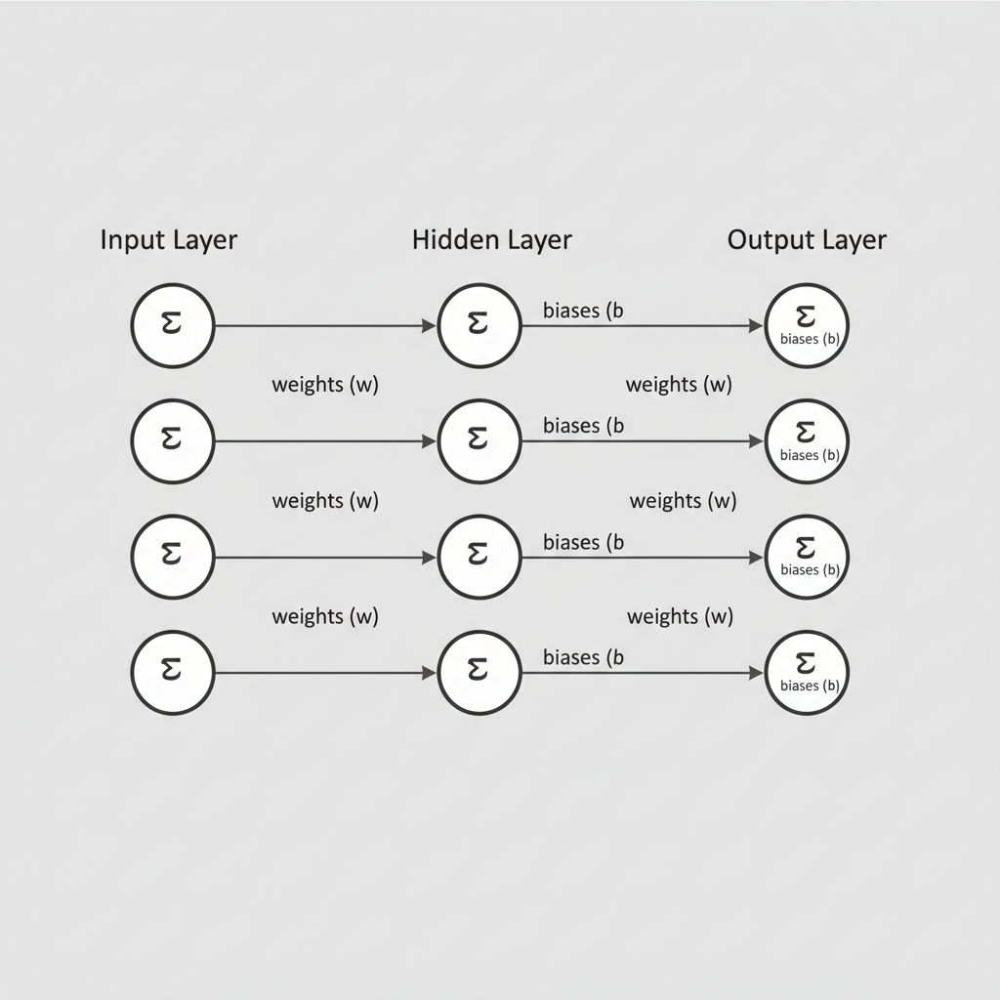
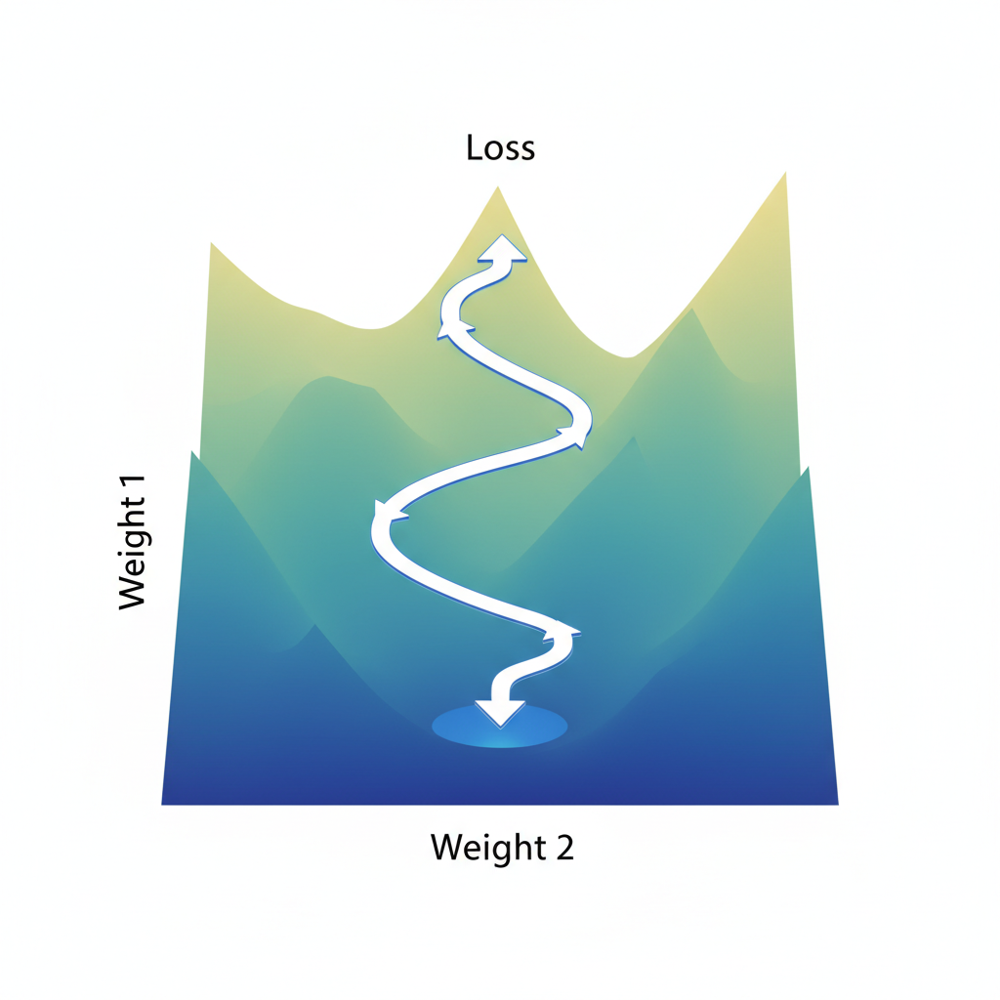
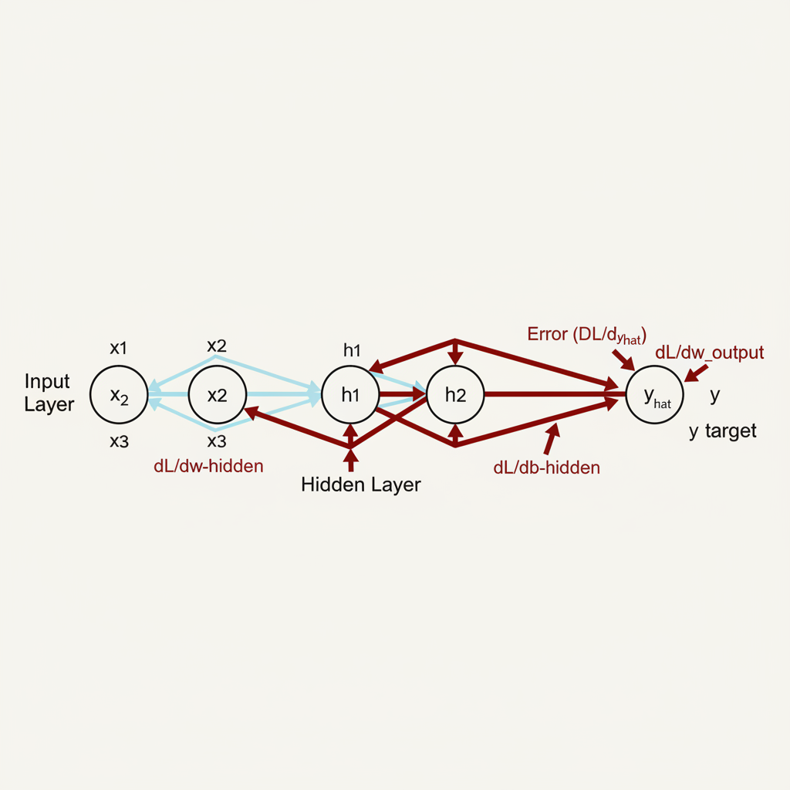

# Backpropagation Explained: The Engine Behind Deep Learning

## Introduction to Backpropagation

At the heart of nearly every successful deep learning model lies **backpropagation**, an ingenious algorithm primarily responsible for efficiently computing the gradients of the loss function with respect to all the weights in a neural network. Without it, training complex, multi-layered neural networks would be computationally intractable. It's the essential mechanism that allows a network to "learn" from its errors and iteratively refine its internal parameters across many layers.

Historically, the widespread adoption and refinement of backpropagation in the 1980s and 1990s, particularly its re-popularization in the mid-2000s, were pivotal in overcoming the limitations of earlier AI approaches and fueled the deep learning revolution we see today. It transformed neural networks from theoretical curiosities into powerful, practical tools.

To intuitively grasp its purpose, imagine you're trying to tune a complex stereo system with many interconnected dials (weights) to produce a perfect sound (minimize loss). Backpropagation is like having a smart assistant who, after hearing the current sound, tells you precisely how much and in which direction to adjust *each specific dial* to get closer to your desired output. It systematically propagates the "error signal" backward through the network, layer by layer, guiding the necessary adjustments.

## Neural Network Fundamentals: A Quick Recap

Before diving into the intricacies of backpropagation, let's quickly refresh our understanding of the fundamental components of a neural network and how data flows through it. At its core, a neural network is composed of interconnected `neurons` (or nodes) organized into distinct `layers`. Data first enters the `input layer`, which receives the raw features. This information then passes through one or more `hidden layers`, where complex computations and feature transformations occur. Finally, the processed information reaches the `output layer`, which produces the network's prediction or classification.

The connections between neurons are not uniform; they are weighted. These `weights` (`w`) represent the strength and importance of each connection, determining how much influence one neuron's output has on the next. Additionally, each neuron typically has a `bias` (`b`), an independent offset that allows the neuron to activate even when all its inputs are zero. Together, weights and biases are the network's adjustable parameters, which are learned during the training process.

To enable the network to learn and model non-linear relationships in data, each neuron's output (after summing weighted inputs and adding the bias) is passed through an `activation function`. These functions introduce non-linearity, allowing the network to approximate more complex functions. Common examples include the `Rectified Linear Unit (ReLU)`, `Sigmoid`, and `Tanh`.

The journey of data through this architecture, from the input layer, through the hidden layers, to the output layer, is called the `forward pass`.


*A basic feedforward neural network architecture, illustrating the flow of data from input to output during the forward pass.*

During a forward pass, input data is processed sequentially: each neuron calculates a weighted sum of its inputs, adds its bias, and applies its activation function to produce an output, which then serves as input for the subsequent layer. This propagation continues until the network generates a final prediction at the output layer.

## The Forward Pass in Detail

Before we can adjust a neural network's parameters, we must first understand how it makes a prediction. This process is known as the **forward pass**, where input data propagates through the network's layers, undergoing transformations until an output is produced.

At its core, a neural network is a collection of interconnected neurons. For a single neuron, the first step involves calculating a weighted sum of its inputs. Each input `x_i` from the previous layer (or the initial input features) is multiplied by an associated weight `w_i`. These products are then summed, and a bias term `b` is added. This intermediate result, often denoted as `z`, represents the neuron's "activation potential":

$$z = \sum_{i=1}^{n} (w_i x_i) + b$$

Once `z` is computed, it's passed through an **activation function**, denoted `f`. This function introduces crucial non-linearity into the network. Without activation functions, a deep neural network, no matter how many layers it has, would essentially behave like a single linear model, severely limiting its ability to learn complex, non-linear relationships in data. Common activation functions include ReLU (Rectified Linear Unit), Sigmoid, and Tanh, each serving different purposes. The output of the activation function, `a`, becomes the neuron's final output:

$$a = f(z)$$

This output `a` then serves as an input to neurons in the subsequent layer. This process of calculating weighted sums and applying activation functions is chained across multiple layers: from the input layer, through one or more hidden layers, and finally to the output layer. Each layer takes the outputs of the previous layer as its inputs, performing its own set of `z = Wx + b` and `a = f(z)` computations. The final outputs from the last layer represent the network's prediction, whether it's a classification probability or a regression value.

Here's a minimal Python example for a single neuron's calculation:

```python
import numpy as np

def sigmoid(x):
    return 1 / (1 + np.exp(-x))

def neuron_output(inputs, weights, bias):
    # Calculate the weighted sum + bias
    z = np.dot(inputs, weights) + bias
    # Apply the activation function
    a = sigmoid(z) # Using sigmoid as an example activation
    return a

# Example usage for a single neuron
inputs = np.array([0.5, 0.2])
weights = np.array([0.9, 0.7])
bias = 0.1

output = neuron_output(inputs, weights, bias)
print(f"Neuron output: {output:.4f}")
```

This systematic propagation of data from input to output is the forward pass, setting the stage for evaluating the network's performance and, ultimately, for learning.

## Quantifying Error: The Loss Function

Before a neural network can learn, it must first understand how "wrong" its predictions are. This is the crucial role of the **loss function**, also known as the cost function or error function. Its primary purpose is to quantify the discrepancy between the network's output for a given input and the actual, desired target value. Essentially, it provides a measurable score of the model's performance on a single data point or a batch of data.

Different types of problems necessitate different loss functions. For regression tasks, where the goal is to predict continuous values, a common choice is **Mean Squared Error (MSE)**, which calculates the average of the squared differences between predicted and actual values. For classification problems, where the network predicts probabilities across different classes, **Cross-Entropy** (or Log Loss) is widely used, penalizing incorrect and confident predictions more heavily.

The entire training process of a deep learning model revolves around minimizing this loss value. By iteratively adjusting the network's internal parameters (weights and biases), the goal is to drive this error score as close to zero as possible. We can visualize this optimization problem as navigating a "loss landscape," a multi-dimensional surface where each point represents a combination of network parameters, and its height corresponds to the associated loss value. The training algorithm's job is to find the lowest points (minima) in this landscape.


*The "loss landscape" visualizes the loss function's value across different parameter combinations, with gradient descent iteratively guiding the model towards a minimum.*

## The Intuition Behind Backpropagation: Gradients and the Chain Rule

At its heart, training a neural network is an optimization problem: we want to find the set of weights and biases that minimize a chosen **loss function**. Imagine this loss function as a complex, multi-dimensional landscape. A **gradient** is a vector that tells us, at any given point on this landscape, the direction of the steepest ascent and the magnitude of that incline. Think of it as an arrow pointing directly uphill, indicating not only *which way* is up, but also *how steep* that path is.

If our goal is to minimize the loss – to find the lowest point in this landscape – it logically follows that we should move in the *opposite* direction of the gradient. This fundamental principle is known as **gradient descent**. By iteratively taking small steps against the gradient, we gradually descend towards a minimum, reducing the network's error with each adjustment to its parameters.

But how do we calculate these crucial gradients for every single weight and bias in a deep, multi-layered neural network? This is where the **chain rule** of calculus becomes the mathematical cornerstone of backpropagation. A neural network is a sophisticated composition of many functions, where the output of one layer serves as the input to the next, ultimately leading to the final loss value. The chain rule provides a way to compute the derivative of such composite functions.

To grasp its role, consider an analogy: imagine you're adjusting a complex machine (your neural network) with many interconnected levers (weights and biases) to achieve a desired final output (minimal loss). If the final output isn't right, you need to know which lever to adjust and by how much. The challenge is that adjusting an early lever might affect intermediate components, which then affect later components, and finally the output. The chain rule is like systematically tracing back through all these interconnected effects. It allows us to determine how much a tiny change in an early lever contributes to the final outcome, by multiplying the sensitivities of each intermediate step. This way, backpropagation efficiently calculates the impact of every single parameter on the total loss, enabling precise adjustments for optimal performance.

## The Backward Pass: Deriving and Propagating Gradients

The backward pass is the algorithmic heart of neural network training, leveraging the chain rule to efficiently calculate the gradients of the loss function with respect to every weight and bias. These gradients indicate how parameters should be adjusted to minimize the network's error.

### Initiating the Gradient Calculation

Gradient calculation begins at the output layer. Here, we first determine the gradient of the total loss ($L$) with respect to the output layer's activations ($a^{(L)}$). This initial error signal, $\frac{\partial L}{\partial a^{(L)}}$, quantifies how much the loss changes for a small change in the network's final output. For a Mean Squared Error (MSE) loss, where $y$ is the true label and $\hat{y}$ is the network's output, this is $\frac{\partial L}{\partial \hat{y}} = -(y - \hat{y})$. This value serves as the starting point for backward propagation.

### Propagating Gradients Backward with the Chain Rule

With the output layer's error signal, we propagate it backward, layer by layer, using the chain rule. For any given layer $l$, its activation $a^{(l)} = \sigma(z^{(l)})$, where $z^{(l)} = W^{(l)} a^{(l-1)} + b^{(l)}$.

First, we find the gradient of the loss with respect to the pre-activation $z^{(l)}$:
$$ \frac{\partial L}{\partial z^{(l)}} = \frac{\partial L}{\partial a^{(l)}} \cdot \frac{\partial a^{(l)}}{\partial z^{(l)}} $$
Here, $\frac{\partial a^{(l)}}{\partial z^{(l)}}$ is the derivative of the activation function, $\sigma'(z^{(l)})$. This $\frac{\partial L}{\partial z^{(l)}}$ term is the "delta" for layer $l$.

Next, this delta is propagated to the previous layer ($l-1$) to calculate $\frac{\partial L}{\partial a^{(l-1)}}$:
$$ \frac{\partial L}{\partial a^{(l-1)}} = \frac{\partial L}{\partial z^{(l)}} \cdot \frac{\partial z^{(l)}}{\partial a^{(l-1)}} $$
This process continues backward until the input layer.

### Calculating Gradients for Weights and Biases

Once $\frac{\partial L}{\partial z^{(l)}}$ (the delta) is known for a layer $l$, we can compute the gradients for its weights ($W^{(l)}$) and biases ($b^{(l)}$). Since $z^{(l)} = W^{(l)} a^{(l-1)} + b^{(l)}$:

*   **For Weights:** $$ \frac{\partial L}{\partial W^{(l)}} = \frac{\partial L}{\partial z^{(l)}} \cdot (a^{(l-1)})^T $$
*   **For Biases:** $$ \frac{\partial L}{\partial b^{(l)}} = \frac{\partial L}{\partial z^{(l)}} \cdot 1 $$

These calculations provide the necessary information for the optimizer to update $W^{(l)}$ and $b^{(l)}$.

### Simplified Example: Single Neuron Gradient Calculation

Consider a single neuron with inputs $x_1, x_2$, weights $w_1, w_2$, bias $b$, and sigmoid activation $\sigma$. Its output is $a = \sigma(z)$, where $z = w_1 x_1 + w_2 x_2 + b$. Assuming we have the upstream gradient $\frac{\partial L}{\partial a}$:

1.  **Gradient of Loss w.r.t. Pre-activation ($z$):**
    $$ \frac{\partial L}{\partial z} = \frac{\partial L}{\partial a} \cdot \sigma'(z) $$

2.  **Gradients of Loss w.r.t. Weights ($w_1, w_2$):**
    $$ \frac{\partial L}{\partial w_1} = \frac{\partial L}{\partial z} \cdot x_1 $$
    $$ \frac{\partial L}{\partial w_2} = \frac{\partial L}{\partial z} \cdot x_2 $$

3.  **Gradient of Loss w.r.t. Bias ($b$):**
    $$ \frac{\partial L}{\partial b} = \frac{\partial L}{\partial z} \cdot 1 $$

A conceptual Python snippet illustrates these calculations:

```python
import numpy as np

def sigmoid(x):
    return 1 / (1 + np.exp(-x))

def sigmoid_prime(x):
    s = sigmoid(x)
    return s * (1 - s)

# Assume pre-calculated for a single neuron
upstream_dL_da = 0.5 # dL/da from the next layer or loss function
x1, x2 = 0.7, 0.3    # Inputs
w1, w2 = 0.1, 0.2    # Current weights
b = 0.05             # Current bias

# Forward pass (needed for z and sigmoid'(z))
z = w1 * x1 + w2 * x2 + b

# 1. Calculate dL/dz (the 'delta' for this neuron)
dL_dz = upstream_dL_da * sigmoid_prime(z)

# 2. Calculate dL/dw1, dL_dw2
dL_dw1 = dL_dz * x1
dL_dw2 = dL_dz * x2

# 3. Calculate dL/db
dL_db = dL_dz * 1

# print(f"dL/dz: {dL_dz:.4f}")
# print(f"dL/dw1: {dL_dw1:.4f}")
# print(f"dL/dw2: {dL_dw2:.4f}")
# print(f"dL/db: {dL_db:.4f}")
```


*The backward pass in backpropagation, where error signals (gradients) are propagated from the output layer back through the network to update weights and biases.*

This iterative backward propagation of error signals and parameter gradient calculations is fundamental to how deep networks learn.

## Updating Weights and Biases: Gradient Descent

After backpropagation calculates the gradients—the partial derivatives of the loss function with respect to each weight and bias—the next crucial step is to use this information to adjust the network's parameters. This is where **Gradient Descent** comes into play, serving as the primary optimization algorithm for training neural networks. The core idea is to iteratively tweak the weights and biases in the direction that minimizes the loss function.

Each parameter (weight $w$ or bias $b$) is updated using a simple rule:
$parameter_{new} = parameter_{old} - \text{learning\_rate} \times \text{gradient}$

The **learning rate** is a critical hyperparameter that dictates the size of the steps taken during each update. A high learning rate can cause the optimization to overshoot the minimum, leading to oscillations or divergence. Conversely, a very small learning rate can result in extremely slow convergence, requiring many more iterations to reach an optimal solution. Finding an appropriate learning rate is often key to efficient training.

This process is inherently **iterative**. The entire dataset is typically passed through the network, gradients are calculated, and parameters are updated, a predefined number of times, with each pass known as an **epoch**. Over many epochs, the network gradually learns to make more accurate predictions as the loss function is progressively minimized.

While vanilla Gradient Descent computes gradients over the entire training dataset before each update (batch gradient descent), practical implementations often use variants. **Stochastic Gradient Descent (SGD)** updates parameters after processing each individual training example, introducing more noise but potentially faster initial convergence. **Mini-batch gradient descent**, a widely used compromise, calculates gradients and updates parameters using a small, randomly sampled subset of the training data, balancing stability and computational efficiency.

## Practical Considerations and Common Challenges

While backpropagation is the workhorse of deep learning, its practical application introduces several considerations and potential challenges. Its elegance lies in its automatic differentiation capabilities, which are seamlessly integrated into modern deep learning frameworks like TensorFlow and PyTorch. These frameworks abstract away the complex calculus, allowing developers and researchers to define network architectures and loss functions, with the framework handling the efficient computation of gradients required for weight updates. This automation has been pivotal in the widespread adoption and rapid advancement of deep learning.

However, training deep neural networks with backpropagation is not without its hurdles. One of the most significant challenges is the problem of **vanishing gradients**. As gradients are propagated backward through many layers, they can become progressively smaller, eventually approaching zero. This phenomenon is particularly prevalent in very deep networks or when using activation functions like sigmoid or tanh, whose derivatives are very small over large input ranges. When gradients vanish, the weights in the initial layers of the network receive negligible updates, causing those layers to learn extremely slowly or even stop learning altogether, effectively hindering the network's ability to capture complex patterns.

Conversely, another potential issue is **exploding gradients**. This occurs when gradients accumulate and become extremely large during backpropagation, leading to massive updates to network weights. Such large updates can cause the learning process to diverge, making the model unstable and preventing it from converging to an optimal solution.

Fortunately, several techniques have been developed to mitigate these gradient issues. The adoption of **ReLU (Rectified Linear Unit)** and its variants (e.g., Leaky ReLU, ELU) as activation functions has been crucial in combating vanishing gradients. Unlike sigmoid or tanh, ReLU has a constant gradient of 1 for positive inputs, preventing saturation and allowing gradients to flow more effectively. Additionally, **careful weight initialization** strategies (e.g., He initialization for ReLU networks, Xavier/Glorot initialization) help set initial weights in a range that prevents gradients from being too small or too large at the start of training. For exploding gradients, **gradient clipping** is a common and effective solution, where gradients are capped at a predefined threshold if their magnitude exceeds it, ensuring that updates to weights remain within a reasonable range.

## Conclusion and Further Exploration

Backpropagation is the fundamental algorithm powering nearly all modern deep neural networks. It is the sophisticated "engine" enabling these complex models to learn intricate patterns from data, transforming raw inputs into meaningful predictions.

We've explored its core mechanics: the **forward pass** for prediction, **loss** calculation, **gradients** computed via the **backward pass** to determine error direction, and subsequent **weight updates**. This iterative process allows networks to progressively minimize errors and improve performance.

To truly solidify your understanding, we highly encourage implementing a simple backpropagation algorithm from scratch, perhaps for a basic multi-layer perceptron. This hands-on experience will illuminate its mathematical elegance and computational steps.

For deeper exploration, investigate advanced **optimizers** (e.g., Adam, RMSprop) that enhance weight updates, and how backpropagation adapts for specific architectures like **Convolutional Neural Networks (CNNs)** or **Recurrent Neural Networks (RNNs)**. Mastering backpropagation is a crucial step towards deep learning proficiency.
