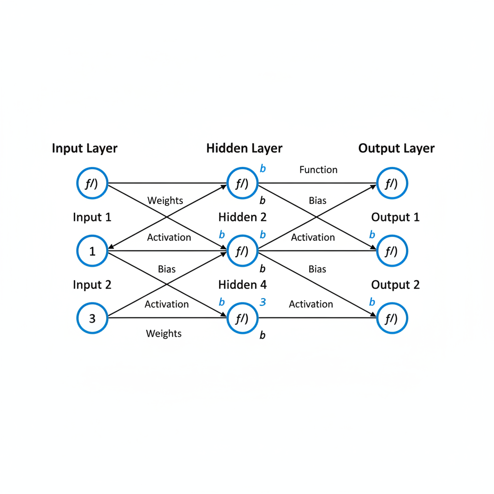
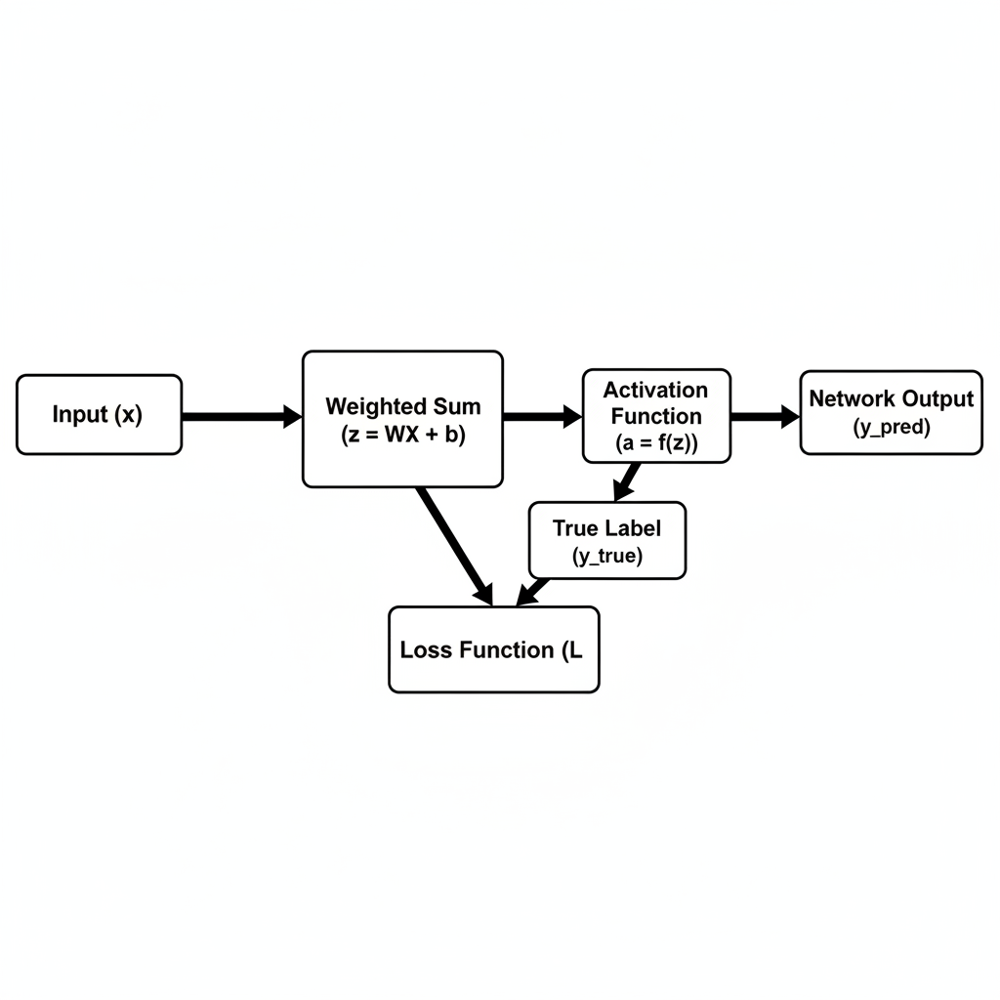
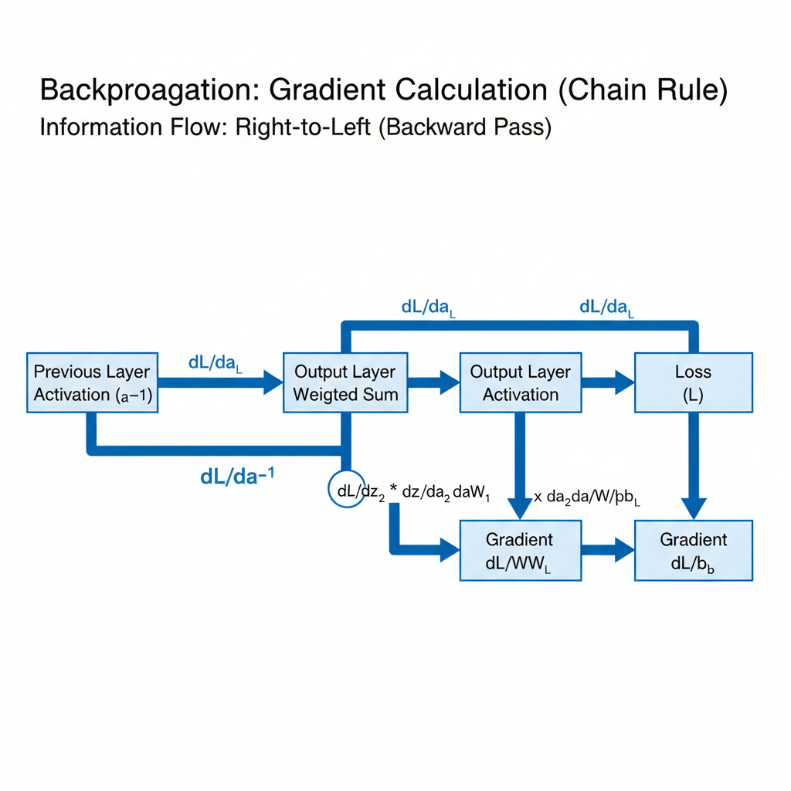

# Demystifying Backpropagation: The Core Engine of Deep Learning

## Introduction: Unveiling Backpropagation

At the heart of nearly every successful deep learning application lies a remarkably elegant and powerful algorithm: backpropagation. Simply put, **backpropagation is the fundamental algorithm used to train Artificial Neural Networks (ANNs)**. It provides an efficient method for a neural network to learn from its mistakes and improve its performance over time.

**Its primary purpose is to efficiently adjust the internal parameters (weights and biases) of a neural network** to minimize the prediction error. During training, a network makes predictions, and backpropagation then calculates how much each weight and bias contributed to the overall error. This information is then used to update these parameters in a direction that reduces the discrepancy between the network's output and the desired target, effectively guiding the network towards better accuracy.

While its core principles have roots in earlier work, the widespread adoption and refinement of backpropagation in the 1980s, particularly by Rumelhart, Hinton, and Williams, truly ignited the field. Today, **it remains the engine powering the vast majority of deep learning models**, from sophisticated image recognition systems to advanced natural language processors. Understanding backpropagation is therefore essential for anyone looking to truly grasp how deep learning models learn and evolve. In the following sections, we'll demystify its elegant mechanics, breaking down the mathematical intuition behind this powerful algorithm.

## Neural Networks in a Nutshell: Setting the Stage

To understand backpropagation, let's first briefly revisit the structure of a neural network. At its heart, a neural network consists of interconnected **neurons**, organized into distinct **layers**: an **input layer** for receiving data, one or more **hidden layers** for intermediate processing, and an **output layer** for generating final predictions. Neurons in one layer pass information to neurons in the next.

The network's ability to learn stems from its adjustable parameters: **weights** and **biases**. Weights determine the strength of connections between neurons, while biases provide an offset. During the "forward pass," input data flows through the network; each neuron calculates a weighted sum of its inputs, adds its bias, and then applies an **activation function**. These non-linear functions (e.g., ReLU, sigmoid) are vital for enabling the network to learn complex, non-linear patterns, allowing it to move beyond simple linear relationships. This entire process culminates in the network's prediction.

*A foundational feedforward neural network, illustrating input, hidden, and output layers, along with the interconnected neurons, weights, biases, and activation functions that define its structure.*

## The Forward Pass: From Input to Prediction

The journey of data through a neural network begins with the **forward pass**, a sequential process where information flows from the input layer all the way to the output layer to generate a prediction. Imagine your input data, whether it's pixel values from an image or numerical features, entering the network's first layer.

From there, this data propagates through each subsequent layer. At every individual neuron within a hidden layer, a crucial two-step calculation takes place. First, the neuron computes a **weighted sum** of all its inputs from the previous layer, adding a unique **bias** term. This sum represents the neuron's initial response. Immediately following this, the result is transformed by a non-linear **activation function** (such as ReLU or sigmoid). This activation is vital, as it introduces the non-linearity necessary for the network to learn complex relationships and patterns in the data.

The activated output from one layer then serves as the input for the neurons in the next layer. This process of weighted summation and activation repeats across all hidden layers. Finally, the processed information reaches the **output layer**, where a final calculation, often employing an activation function tailored to the specific task (e.g., softmax for classification, linear for regression), culminates in the network's ultimate **prediction**. This prediction is the network's best estimate or classification based on the input data it has processed.

*The forward pass: Input data sequentially flows through weighted sums and activation functions to produce a prediction, which is then compared against the true label by the loss function.*

## Measuring Error: The Loss Function

At the heart of training a neural network is the ability to tell if it's doing well or poorly. This is where the **loss function** (also known as a cost function or error function) comes in. Its fundamental purpose is to quantify the discrepancy between the network's predicted output and the actual true label or value. In essence, it provides a single, quantifiable measure of 'how wrong' the network's current predictions are for a given input. A lower loss value signifies better performance, indicating the network's predictions are closer to the ground truth.

Different tasks require different ways to measure this error. For **regression** problems, where the network predicts a continuous value (e.g., house prices), the **Mean Squared Error (MSE)** is a common choice, calculating the average of the squared differences between predictions and true values. For **classification** tasks, where the network predicts probabilities for different categories (e.g., identifying objects in an image), **Cross-Entropy Loss** is widely used, penalizing incorrect and confident predictions heavily.

## The Intuition of Backpropagation: Gradient Descent's Helper

Imagine your deep learning model as trying to navigate a complex mountain range. Each point on this landscape represents a different combination of the model's internal weights, and the height of that point signifies the "cost" or "error" your model makes for those weights. This mental image is what we call the **cost surface**. Our ultimate goal is to find the lowest point in this landscape – the set of weights that minimizes the model's error.

To find our way down this cost surface, we need a compass that tells us which way is downhill and how steep that descent is. This is where **backpropagation** comes in. Its primary role is to efficiently calculate the **gradients** (slopes) of the loss function with respect to every single weight in the neural network. A gradient tells us precisely how much a tiny adjustment to a specific weight will impact the overall error.

The brilliance of backpropagation lies in its systematic approach to **distributing the error backward** through the network. Starting from the final output layer, where the error is directly measurable, it propagates this error signal layer by layer, all the way back to the initial input layers. This process allows us to understand how much each individual weight, regardless of its depth in the network, contributed to the model's overall inaccuracy.

Once backpropagation provides these crucial gradients – our "map" of the steepest descent – we hand them over to an optimization algorithm like **Gradient Descent**. Gradient Descent then uses these gradients to update the weights, nudging them in the direction that most effectively reduces the loss. Thus, backpropagation is not the optimizer itself, but rather the indispensable engine that supplies Gradient Descent with the information it needs to find the optimal weights and guide our model to the bottom of that cost surface.

## The Chain Rule Unveiled: Calculating Gradients

At the heart of backpropagation's ability to learn lies a fundamental concept from calculus: the **chain rule**. This powerful rule allows us to compute the derivative of composite functions – functions nested within each other. If we have a function $y = f(u)$ where $u = g(x)$, the chain rule states that the derivative of $y$ with respect to $x$ is the product of the derivative of $y$ with respect to $u$ and the derivative of $u$ with respect to $x$: $\frac{dy}{dx} = \frac{dy}{du} \cdot \frac{du}{dx}$. This elegantly breaks down complex derivatives into simpler, manageable parts.

In a neural network, the loss function $L$ is a composite function of many layers, activations, and weights. For instance, the loss depends on the network's output, which depends on the final layer's activation, which depends on its weighted sum, which in turn depends on the weights themselves. To find how a change in a weight in the *output layer* affects the overall loss ($\frac{\partial L}{\partial W_L}$), we apply the chain rule. We calculate the derivative of the loss with respect to the output, then the output with respect to the final activation, and so on, until we reach the specific weight. This gives us a direct path to understanding the impact of that weight.

The true genius of backpropagation is its **backward flow** of gradients. Once we've calculated the gradients for the output layer's weights and biases, we have an "error signal" representing how sensitive the loss is to changes in that layer's activations ($\frac{\partial L}{\partial a_L}$). This signal is then propagated *backward* to the preceding layer. Using the chain rule again, this error signal ($\frac{\partial L}{\partial a_L}$) is combined with the local gradients of the previous layer's activation functions and weights to compute $\frac{\partial L}{\partial W_{L-1}}$ and $\frac{\partial L}{\partial b_{L-1}}$.

Imagine a simple network: input -> hidden layer -> output layer. The process unfolds as follows:
1.  **Forward Pass**: Data flows from input to output, calculating predictions and intermediate activations.
2.  **Output Layer Gradients**: Calculate $\frac{\partial L}{\partial W_{output}}$ and $\frac{\partial L}{\partial b_{output}}$ by applying the chain rule, starting from the loss function and working backward through the output layer.
3.  **Backward Propagation to Hidden Layer**: Using the gradients computed for the output layer's activations ($\frac{\partial L}{\partial a_{output}}$), we compute $\frac{\partial L}{\partial W_{hidden}}$ and $\frac{\partial L}{\partial b_{hidden}}$. This involves multiplying the "error signal" from the output layer by the local derivatives within the hidden layer.
This iterative process continues backward through all layers until the input. A key benefit of this approach is **computational efficiency**: the error signal (e.g., $\frac{\partial L}{\partial z_L}$) calculated for a later layer is reused multiple times to compute the gradients for the weights and biases of the *preceding* layer, avoiding redundant calculations and making the training process feasible for deep networks.

*Backpropagation in action: Gradients of the loss function are efficiently propagated backward through the network layers using the chain rule, enabling the calculation of each weight's contribution to the overall error.*

## Weight Updates: Learning from Error

Once we've calculated the gradients for all weights and biases, the next crucial step is to use this information to actually improve our network. This is where the **gradient descent update rule** comes into play. For each weight in the network, we adjust it using the following formula:

`new_weight = old_weight - (learning_rate * gradient)`

Here, `old_weight` is the current value of the weight, `gradient` tells us the direction and magnitude of the steepest ascent of the loss function, and `learning_rate` is a critical hyperparameter. We subtract the `(learning_rate * gradient)` term because our goal is to minimize the loss, and the gradient points in the direction of *increasing* loss. By moving in the opposite direction, we descend towards the minimum.

The **learning rate** dictates the size of the steps we take down the loss landscape. A high learning rate can lead to overshooting the minimum or even diverging, causing the loss to increase. Conversely, a very small learning rate can make the training process extremely slow, potentially getting stuck in local minima, and taking an unacceptably long time to converge. Finding an optimal learning rate is often a balance that requires experimentation.

This adjustment process is inherently **iterative**. Training a deep learning model involves many **epochs**, where each epoch represents a full pass through the entire training dataset. Within each epoch, the data is typically divided into smaller **batches**. For each batch, the network performs a forward pass, calculates the loss, backpropagates to compute gradients, and then updates the weights. Through these numerous, small, and consistent adjustments across many batches and epochs, the model gradually learns. This iterative refinement slowly but surely brings the network's weights closer to values that minimize the overall error, leading to a converged model that performs effectively on new data.

## Beyond the Basics: Practical Considerations

While the core mechanics of backpropagation are elegant, real-world deep learning presents several challenges. One significant hurdle is **vanishing and exploding gradients**. Vanishing gradients occur when gradients become extremely small as they propagate backward through many layers, causing earlier layers to learn very slowly or stop learning altogether. Conversely, exploding gradients lead to extremely large updates, making the training process unstable and prone to divergence.

The choice of **activation function** plays a crucial role in gradient flow. Functions like Sigmoid, with their saturating regions, can contribute to vanishing gradients, as their derivatives approach zero. Rectified Linear Units (ReLU) and its variants, by contrast, offer a constant gradient for positive inputs, significantly alleviating the vanishing gradient problem and promoting more stable and faster training.

Furthermore, while backpropagation calculates the gradients, **optimizers** are responsible for using these gradients to update the model's weights effectively. Basic Stochastic Gradient Descent can be slow and oscillate. Advanced optimizers like Adam and RMSprop build upon the backpropagation mechanism by adaptively adjusting learning rates for each parameter, leading to faster convergence and often better performance.

Finally, **regularization techniques** are vital to prevent overfitting, where a model learns the training data too well, including its noise, and performs poorly on unseen data. Techniques such as L1/L2 regularization (weight decay) and Dropout modify the loss function or the training process, encouraging the backpropagation algorithm to learn more robust and generalizable features, ultimately leading to better real-world application performance.
