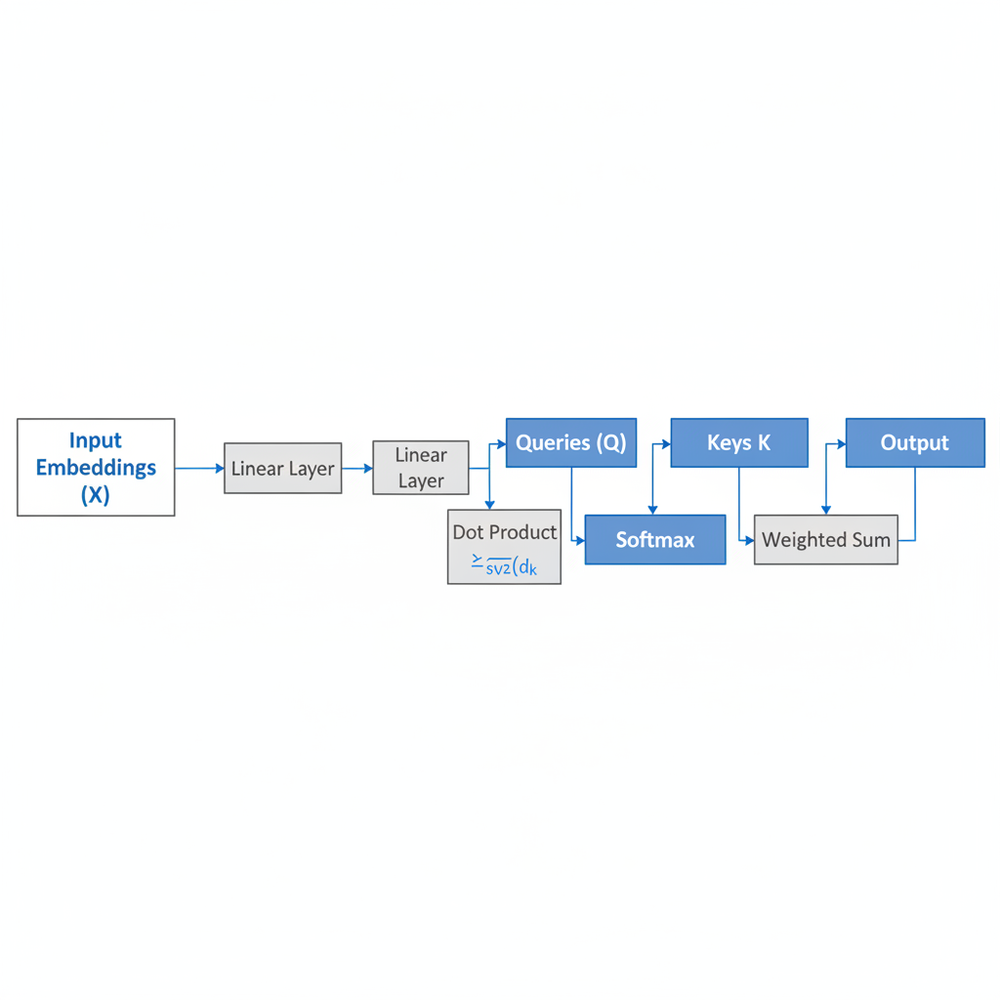
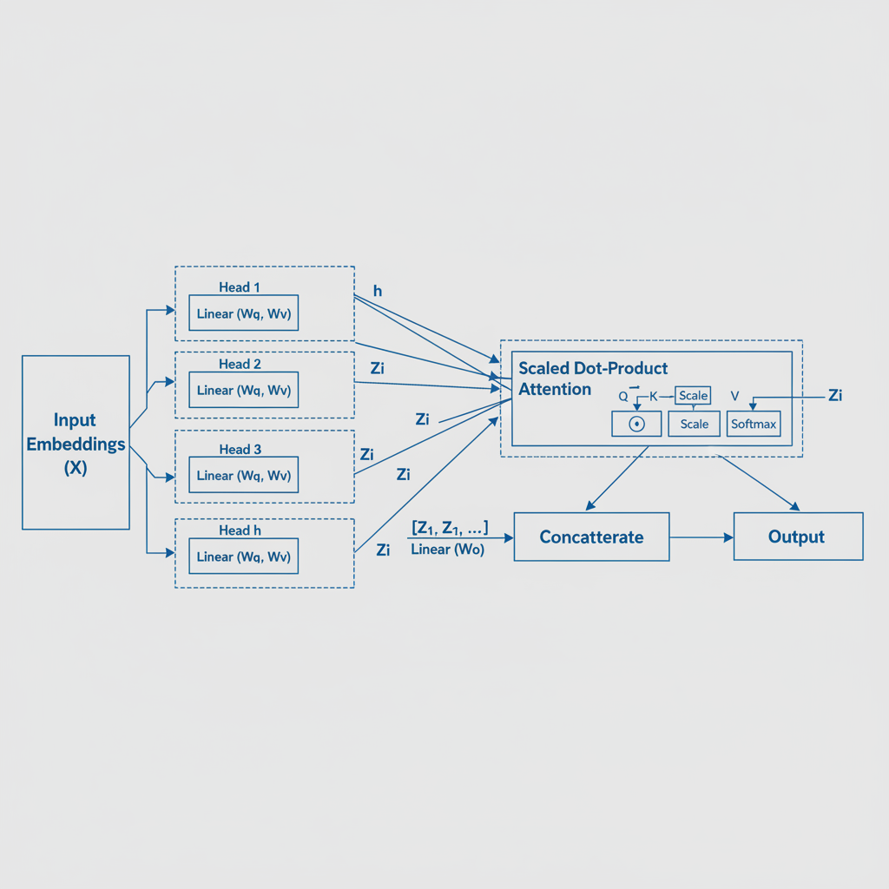
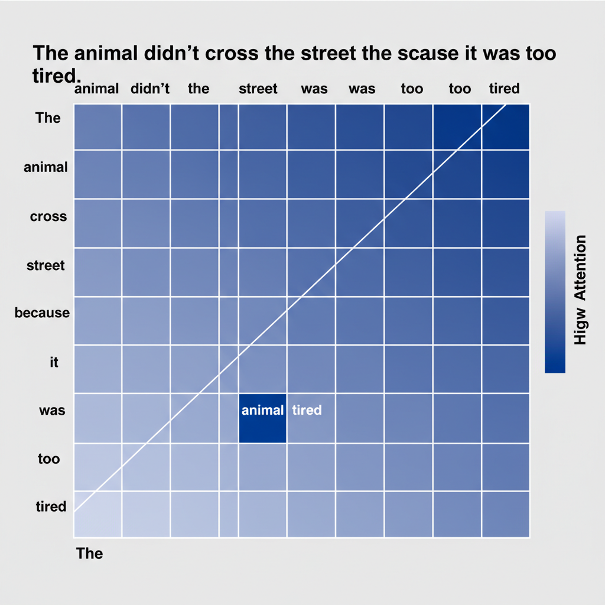

# Demystifying Multi-Head Attention in Transformers

## Introduction to Transformers and the Need for Attention

The Transformer architecture marked a significant breakthrough in sequence modeling, fundamentally changing how machine learning models process data like text and time series. Before Transformers, recurrent neural networks (RNNs) such as LSTMs and GRUs were the state-of-the-art. However, these traditional models faced inherent limitations. Their sequential processing nature made them slow and difficult to parallelize, and they struggled with issues like vanishing or exploding gradients, which hampered their ability to efficiently capture long-range dependencies across extended input sequences.

To overcome these challenges, the concept of 'attention' emerged. At its core, attention is a mechanism that allows a model to weigh the importance of different parts of an input sequence when encoding or decoding a specific element. Instead of processing all inputs equally, attention enables the model to focus on the most relevant information.

Within the Transformer architecture, 'self-attention' became the pivotal innovation. This specific form of attention allows each element in an input sequence to interact with every other element, calculating dynamic weights that determine their relative importance. This design enables Transformers to model long-range dependencies effectively and process sequences in parallel, leading to unprecedented performance gains in various natural language processing tasks.

## Foundational Concept: Single-Head Self-Attention

Within the Transformer architecture, the fundamental unit of attention is the single self-attention head. For each token in an input sequence, its embedding (or the output from a previous layer) is linearly transformed into three distinct abstract representations: Queries (Q), Keys (K), and Values (V). Conceptually, a Query represents what a token is looking for, a Key represents what a token can offer, and a Value holds the actual content or information of that token.

To determine how much attention each token should pay to others, raw attention scores are calculated. This involves taking the dot product between a specific token's Query vector and the Key vector of *every* token in the input sequence (including itself). A higher dot product indicates greater similarity or relevance.

These raw dot product scores are then scaled. Specifically, they are divided by the square root of the Key vector's dimension (`sqrt(d_k)`). This scaling is crucial for preventing the dot products from growing excessively large, which could push the subsequent softmax function into regions with extremely small gradients, thereby hindering effective model training.

Following scaling, a softmax function is applied across all scaled scores for a given Query. This normalizes the scores into a set of positive values that sum to one, transforming them into attention weights. These weights quantify the importance or relevance of each input token to the current Query token.

Finally, these attention weights are used to compute a weighted sum of the Value vectors. Each Value vector is multiplied by its corresponding attention weight, and all these weighted Values are summed together. The resulting vector is the context-aware output for the current Query position, representing the aggregated information from the entire input sequence as perceived by this single attention head.


*The core mechanism of a single self-attention head, showing the transformation of input into Query, Key, and Value vectors, followed by scaled dot-product attention and weighted summation.*

## The 'Head' in Multi-Head: Linear Projections for Diverse Perspectives

Before attention scores are computed, the initial step for Multi-Head Attention involves transforming the input embeddings. For each individual attention head, the same input embeddings—typically the token representations from the encoder's output or the previous decoder layer—are first projected into three distinct matrices: Query (`Q`), Key (`K`), and Value (`V`).

These projections are performed using separate, learnable weight matrices specific to each head. For every head `h`, there are unique `Wq_h`, `Wk_h`, and `Wv_h` matrices. These matrices are multiplied with the input embedding `X` (or the output of the previous layer) to generate the head-specific Query, Key, and Value matrices: `Q_h = X * Wq_h`, `K_h = X * Wk_h`, and `V_h = X * Wv_h`.

This mechanism is crucial because it allows each head to focus on different aspects or subspaces of the input information. Each set of `Wq, Wk, Wv` matrices learns to extract unique features or relationships from the input, providing diverse "perspectives" on the data. For instance, one head might attend to syntactic dependencies, while another might focus on semantic relationships.

Importantly, the dimensions of these projected `Q_h`, `K_h`, and `V_h` matrices are typically smaller than the full model dimension (`d_model`). Specifically, if there are `num_heads`, each head's projected dimension is `d_model / num_heads`. This reduction in dimensionality for each head not only makes the computation efficient but also allows all heads to perform their attention calculations in parallel, contributing to the Transformer's speed.

## Why 'Multi-Head'? The Benefits of Parallel Attention

While a single attention mechanism can identify relationships between tokens, it might struggle to capture the full spectrum of dependencies present in complex data. This is where Multi-Head Attention significantly enhances the Transformer's capabilities.

Instead of performing one attention calculation, Multi-Head Attention runs several attention operations in parallel. Each "head" independently projects the input queries, keys, and values into different, lower-dimensional "representation subspaces." This allows each head to jointly attend to information from different parts of the input sequence and from different angles.

Think of each attention head as a distinct 'lens' or 'expert' specializing in a particular type of relationship. One head might focus on syntactic dependencies, such as identifying the subject and verb in a sentence, while another might specialize in semantic relationships, like recognizing coreferences (different words referring to the same entity). This parallel processing allows the model to simultaneously analyze various aspects of the input without interference.

By combining the outputs from these multiple, specialized heads, the Transformer gains a much richer and more comprehensive understanding of the context. This parallel attention mechanism dramatically enhances the model's capacity to capture a wider range of dependencies—both short-range and long-range—and subtle contextual nuances. Compared to a single, monolithic attention mechanism, Multi-Head Attention provides improved robustness and significantly greater representational power, enabling the model to form more complex and accurate representations of the input.

## Assembling the Multi-Head Output: Concatenation and Final Projection

After distributing the input Query, Key, and Value matrices to individual attention heads, each head computes its output independently and in parallel. This parallel computation is a cornerstone of Multi-Head Attention's efficiency, allowing the model to process different subspaces of the input simultaneously. Each head applies its own set of learned linear transformations (WQ, WK, WV) to project the input into its specific Q, K, and V representations, then performs the scaled dot-product attention calculation. The output of each head is a matrix of shape `(sequence_length, d_v)`, where `d_v` is the dimension of the value vectors for that particular head.

Once all `h` attention heads have produced their respective outputs, the next step is to combine these diverse perspectives. This is achieved through a concatenation operation. The `h` individual output matrices, each of shape `(sequence_length, d_v)`, are joined together along the feature dimension. If we have `h` heads, the concatenated output will have a shape of `(sequence_length, h * d_v)`. This step effectively stacks the results from all heads side-by-side, creating a much wider, richer representation that incorporates all the distinct relational insights learned by each head.

Finally, this concatenated output undergoes a linear projection. A learnable weight matrix, often denoted as `Wo`, is applied to transform the combined representation back to the desired output dimension, `d_model`. The `Wo` matrix has a shape of `(h * d_v, d_model)`. This projection layer serves two critical purposes: first, it reduces the dimensionality of the combined output from `h * d_v` back to `d_model`, ensuring compatibility with subsequent layers in the Transformer block which expect inputs of `d_model` dimensions. Second, and more importantly, it allows the model to learn how to optimally weigh and combine the diverse information extracted by each attention head into a single, cohesive, and enriched representation.


*The complete Multi-Head Attention block, demonstrating how multiple attention heads process different subspaces of the input in parallel, their outputs are concatenated, and then linearly projected to form the final context-aware representation.*

Here's a minimal Python-like pseudocode sketch illustrating this process:

```python
import torch

def multi_head_attention_output(Q_input, K_input, V_input, W_Q_heads, W_K_heads, W_V_heads, W_O, num_heads, d_k, d_v):
    # Assume Q_input, K_input, V_input are (batch_size, seq_len, d_model)
    # W_Q_heads, W_K_heads, W_V_heads are lists of (d_model, d_k/d_v) for each head
    # W_O is (num_heads * d_v, d_model)

    head_outputs = []
    for i in range(num_heads):
        # 1. Project Q, K, V for current head
        q_i = torch.matmul(Q_input, W_Q_heads[i]) # (batch_size, seq_len, d_k)
        k_i = torch.matmul(K_input, W_K_heads[i]) # (batch_size, seq_len, d_k)
        v_i = torch.matmul(V_input, W_V_heads[i]) # (batch_size, seq_len, d_v)

        # 2. Compute Scaled Dot-Product Attention for current head
        scores = torch.matmul(q_i, k_i.transpose(-2, -1)) / (d_k ** 0.5)
        attention_weights = torch.softmax(scores, dim=-1)
        attention_output_i = torch.matmul(attention_weights, v_i) # (batch_size, seq_len, d_v)
        head_outputs.append(attention_output_i)

    # 3. Concatenate all head outputs
    concatenated_output = torch.cat(head_outputs, dim=-1) # (batch_size, seq_len, num_heads * d_v)

    # 4. Final linear projection
    final_multi_head_output = torch.matmul(concatenated_output, W_O) # (batch_size, seq_len, d_model)

    return final_multi_head_output
```

This final output integrates the diverse perspectives captured by each head into a single, comprehensive representation. Each head might attend to different aspects of the input sequence—for instance, one head might focus on syntactic dependencies, another on semantic relationships, and yet another on contextual nuances. By combining these, the Transformer creates a robust and enriched understanding, enabling it to model complex patterns and long-range dependencies effectively.

## Computational Cost and Efficiency Considerations

The self-attention mechanism, a core component of Multi-Head Attention, introduces significant computational and memory costs, primarily driven by sequence length. The computational complexity of calculating attention weights and values for a single head is `O(n^2 * d)`. Here, `n` represents the sequence length (number of tokens), and `d` is the embedding dimension (specifically, `d_k`, the dimension of keys and queries for that head). This quadratic dependency on `n` arises because each token in the sequence must compute its attention score with every other token, including itself. The `d` factor stems from the matrix multiplications involved in computing queries, keys, values, and the subsequent weighted sum.

Memory requirements also scale quadratically with sequence length. While storing the Query (Q), Key (K), and Value (V) matrices for a sequence of length `n` and dimension `d` requires `O(n * d)` memory each, the intermediate attention scores matrix, which is `n x n`, demands `O(n^2)` memory. This quadratic growth becomes a substantial bottleneck for very long sequences.

The 'multi-head' aspect increases the total number of parameters in the attention layers. Each head has its own set of Q, K, V projection matrices. However, if the total `d_model` dimension is split across `h` heads such that each head operates on `d_k = d_model / h` dimensions, then the overall computational complexity *per token* often remains proportional to `d_model`. While the number of parameters increases, the total floating-point operations (FLOPs) for the attention mechanism itself can be comparable to a single large head, as the reduced `d_k` dimension within each head mitigates the cost.

This quadratic scaling in both computation and memory means that processing very long sequences, or using large batch sizes with moderately long sequences, quickly becomes computationally prohibitive. This limitation has spurred research into more efficient attention mechanisms that aim to reduce this `O(n^2)` dependency.

## Interpreting Attention: Debugging and Understanding Model Focus

Understanding what a Transformer model "pays attention to" is crucial for debugging, improving, and ensuring the reliability of your models. Visualizing attention patterns provides a window into the model's internal reasoning.

A primary method for interpretation involves **visualizing attention maps**. These are typically rendered as heatmaps, where rows represent query tokens and columns represent key tokens. The intensity of a cell indicates the attention weight, showing how much a query token focuses on a specific key token. This allows observation of which input tokens are most influential when processing another.

Beyond aggregate views, **analyzing individual attention heads** can reveal specialized functions. While some heads might focus on syntactic relationships (e.g., subject-verb agreement, identifying direct objects), others might track co-reference (linking pronouns to their antecedents) or even positional information. This specialization demonstrates the diverse roles Multi-Head Attention plays in capturing different aspects of input relationships.

When interpreting, watch for **common failure modes**. 'Diagonal' attention, where tokens primarily attend to themselves, suggests a lack of contextual integration. 'Uniform' attention, where a token attends equally to all others, indicates a failure to focus on specific, relevant information. Both patterns imply the attention mechanism isn't learning meaningful dependencies.

For effective debugging, **check attention weights for unexpected patterns**. Are some heads consistently uniform or diagonal? Do they focus disproportionately on punctuation or stop words? Verify **gradient flow through the attention mechanism** during training to ensure it's actively learning. Additionally, observe how attention patterns **change with input perturbations** (e.g., slight rephrasing or token changes) to assess robustness and sensitivity.

Finally, attention patterns can inadvertently **reveal biases learned from training data**. If attention consistently highlights specific tokens in a way that reinforces stereotypes (e.g., associating certain professions with gendered pronouns), it signals that the model has internalized these biases. This makes attention visualization a vital tool for ethical AI development and bias mitigation.


*An example attention heatmap for the sentence "The animal didn't cross the street because it was too tired," illustrating how the pronoun "it" attends strongly to "animal" and "tired."*

## Conclusion: The Enduring Impact of Multi-Head Attention

Multi-Head Attention stands as a cornerstone of the Transformer architecture, delivering several critical advantages. Its design facilitates **parallel processing** of information, significantly speeding up computation compared to sequential models. By employing multiple "heads," it enables the model to extract **diverse feature representations** from different subspaces, capturing a richer and more nuanced understanding of relationships within the input. This collective insight leads to **enhanced contextual understanding**, allowing the model to weigh the importance of various input parts effectively.

This mechanism is not merely an optimization; it's a foundational building block. Its ability to efficiently model long-range dependencies has made it indispensable for advanced Natural Language Processing (NLP) models, and its principles are now being applied across various domains, including computer vision and speech processing.

Ongoing research continues to explore variations and optimizations of attention mechanisms, building directly upon the original Multi-Head Attention paradigm to improve efficiency, interpretability, and performance. We encourage you to delve deeper into practical implementations and explore the vast array of applications that Transformer models, empowered by Multi-Head Attention, have unlocked.
